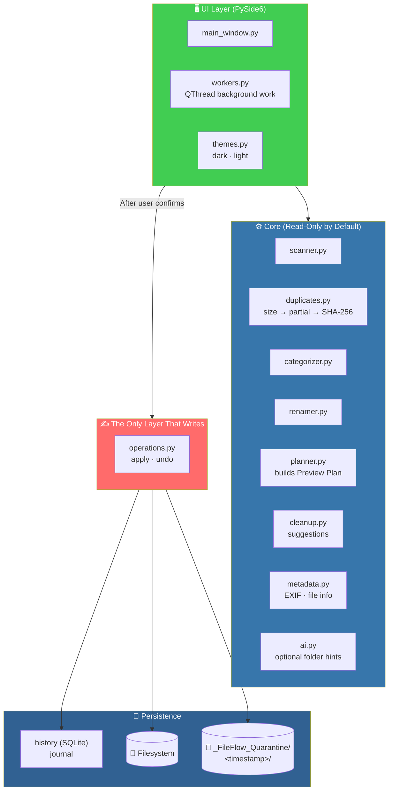
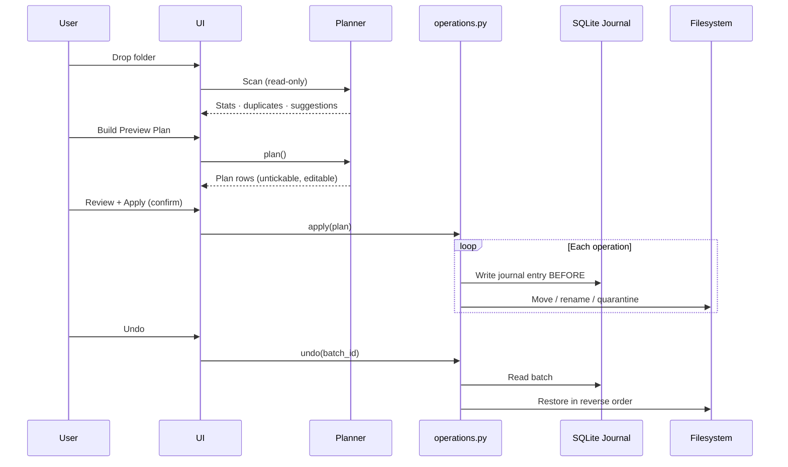

# 🧹 FileFlow — Safe, Previewable File Organizer

<div align="center">


**Scan a messy folder. Find duplicates. Propose a clean structure.**

*Nothing moves, renames, or deletes until you review a Preview Plan and confirm. Everything is journaled and undoable.*

[🛡️ Safety Model](#-safety-model) • [✨ Features](#-features) • [🚀 Run It](#-run-it-windows) • [🧪 Tests](#-tests) • [📦 Build EXE](#-build-the-windows-exe)

</div>

---

## 📖 Overview

**FileFlow** scans a messy folder *— thousands of files is fine —* finds duplicates, and proposes a clean folder structure.

### Core Idea

> **Nothing changes without your explicit confirmation.**
>
> Planning, scanning, and duplicate detection are **read-only**. Only `core/operations.py` touches files, and the UI asks before calling it. Every operation is journaled in SQLite so it can be undone.

### 🔄 The Workflow


---

## 🛡️ Safety Model

> **This is the most important part of FileFlow.**

| Rule | How It's Enforced |
|------|------------------|
| **Nothing changes without confirmation** | Planning / scan / duplicate code is **read-only**; only `core/operations.py` touches files, and the UI asks before calling it |
| **Never overwrite** | An existing destination makes the operation **skip**; plan building also picks `name (1).ext` for clashes |
| **Never silently delete** | "Cleanup" and duplicate removal **move files into `_FileFlow_Quarantine/<timestamp>/`** inside the scanned folder. Empty folders are the only thing removed *(`rmdir`, which refuses non-empty folders)* and are re-created by Undo. **You empty the quarantine yourself** |
| **Full rollback** | Each operation is written to the **journal *before* it runs**. Undo restores files **in reverse order**, never clobbers a file that now sits at the original path, and removes folders FileFlow created if they are empty |
| **Projects are left alone** | Folders containing `.git`, `package.json`, `pyproject.toml`, `*.sln`, `Makefile`, … are **never reorganized**. Hidden files, symlinks, and `desktop.ini` / `Thumbs.db` are ignored by the planner |
| **Cross-drive moves** | **Copy → verify size → remove source** *(no data loss if the copy fails)* |

---

## ✨ Features

<div align="center">

| 🔍 Scanner | 👯 Duplicates |
|:---:|:---:|
| Nested folders · external drives · file count · total size · type breakdown · largest files and folders | **Size → partial hash → full SHA-256** — only real byte-identical files are grouped. Optional **perceptual hashing** *(pHash via `imagehash`)* finds visually similar images |
| **🗂️ Smart Categories** | **✏️ Rename Assistant** |
| Documents · Pictures · Videos · Audio · Code · Archives · keyword-based Finance/Invoices, School, Work, Projects/Notes | `IMG_9382.JPG` → `2026-09-28_Photo_9382.jpg` |
| **🧽 Cleanup Suggestions** | **📜 History / Undo** |
| Empty folders · empty files · temp/partial downloads · `.bak`/`.old` · installers untouched 90+ days | Per-batch journal · undo the latest or any selected batch |
| **🎨 UI** | **🤖 Optional AI** |
| PySide6 · dark/light theme · drag-and-drop · tables · image preview · progress bars · background threads with Cancel | Off by default. Set `FILEFLOW_AI_KEY` to enable folder hints for files rules couldn't classify |

</div>

### 🔍 Scanner

- **Nested folders** — any depth
- **External drives** — any path you can open
- **Shows:**
  - File count
  - Total size
  - Type breakdown
  - **Largest files**
  - **Largest folders**

### 👯 Duplicates

**Three-stage detection:**

1. **Size** — quick filter
2. **Partial hash** — cheap validation
3. **Full SHA-256** — only real byte-identical files are grouped

**Optional perceptual hashing** *(pHash via `imagehash`)* finds **visually similar images** — not just byte-identical ones.

> 💡 **You tick what to keep in each group.**

### 🗂️ Smart Categories

**Built-in categories:**

- Documents
- Pictures
- Videos
- Audio
- Code
- Archives

**Keyword-based categories:**

- Finance / Invoices
- School
- Work
- Projects / Notes

**Special routing for images:**

- `Pictures/<year>` — **EXIF date when present**
- `Pictures/Vacation`
- `Pictures/Screenshots`

> 💡 **Add custom categories** *(keyword → folder)* in the **Categories** tab — **they override the built-ins**.

### ✏️ Rename Assistant

**Example transformation:**

```
IMG_9382.JPG  →  2026-09-28_Photo_9382.jpg
```

**Source of the date:**

- **EXIF date** when present
- Otherwise **file date**

**Bonus:** a meaningful parent folder such as *"Cambodia Trip"* becomes **part of the name**.

**Also tidies:**

- `Copy of x`
- `x - Copy`
- Doubled separators

> 💡 **Suggestions are part of the plan** — untick or **Edit** any row.

### 🧽 Cleanup Suggestions

- Empty folders
- Empty files
- Temp / partial downloads
- `.bak` / `.old` files
- Installers untouched for **90+ days**

> ⚠️ **Nothing is ticked by default.**

### 📜 History / Undo

- **Per-batch journal**
- Undo the **latest batch** or **any selected batch**

### 🎨 UI

- **PySide6** — native desktop feel
- **Dark / light theme**
- **Drag-and-drop** a folder onto the window
- **Tables** for all data
- **Image preview panel**
- **Progress bars**
- **All heavy work on background threads** with a **Cancel** button

### 🤖 Optional AI

> **Everything above works offline.**

**To enable AI hints:**

| Environment Variable | Purpose |
|---------------------|---------|
| `FILEFLOW_AI_KEY` | **Required** to enable AI |
| `FILEFLOW_AI_URL` | *Optional* — any OpenAI-compatible endpoint |
| `FILEFLOW_AI_MODEL` | *Optional* — model name |

**A checkbox appears** that asks the model for folder hints for files the rules couldn't classify.

> 🔒 **Only file *names* are sent.**
>
> **The result still goes through the Preview Plan** — nothing is auto-applied.

---

## 🚀 Run It (Windows)

```bat
run.bat
```

**This will:**

1. Create a `.venv`
2. Install `requirements.txt`
3. Start the app

### Manual Setup

```bat
py -3.11 -m venv .venv
.venv\Scripts\activate
pip install -r requirements.txt
python run_fileflow.py
```

### macOS / Linux

```bash
python3 -m venv .venv
. .venv/bin/activate
pip install -r requirements.txt
python run_fileflow.py
```

### 📝 The Workflow


### 📐 Default Scope

**The default scope is *Loose files only*** — files directly in the folder.

> ⚠️ **Choose *Everything* to also pull files out of sub-folders** — **this flattens them**, so check the preview.

---

## 🧪 Tests

> **The core is tested with the standard library**, so **no extra packages are required**.

```bat
python -m unittest discover -s tests -t . -v
```

*(`pytest` also works.)*

### What's Covered

<div align="center">

| Area | Tests |
|------|:-----:|
| **Scanning** | ✅ |
| **Empty / protected folders** | ✅ |
| **Duplicate detection** — including files that differ only after the partial-hash window | ✅ |
| **Categories** | ✅ |
| **Rename suggestions** | ✅ |
| **Conflict handling** | ✅ |
| **"Planning touches nothing"** | ✅ |
| **Apply → undo restoring the exact original tree** | ✅ |
| **No-overwrite** | ✅ |
| **Undo with changed files** | ✅ |
| **Quarantine / rmdir undo** | ✅ |
| **History persistence** | ✅ |
| **Headless UI smoke test** | ✅ — *runs when PySide6 is installed* |

</div>

---

## 📦 Build the Windows EXE

```bat
build_exe.bat
```

**This will:**

1. Install dev requirements
2. **Run the tests**
3. Run PyInstaller

**Output:** `dist\FileFlow\FileFlow.exe`

> 💡 **Zip the `dist\FileFlow` folder to share.**

### Single-File Option

Add **`--onefile`** to the `pyinstaller` line in the script for a single file — **slower start-up**.

> ⚠️ **Build on Windows** — PyInstaller does not cross-compile.

---

## 🏗️ Architecture

### System Overview



### The Preview Plan Pipeline



### 🗂️ Project Layout

```
fileflow/
├── core/           # all non-UI logic
│   ├── scanner.py
│   ├── duplicates.py
│   ├── categorizer.py
│   ├── renamer.py
│   ├── planner.py
│   ├── operations.py    # ← the only file that touches files
│   ├── history.py       # SQLite journal
│   ├── cleanup.py
│   ├── metadata.py
│   └── ai.py
│
└── ui/
    ├── main_window.py
    ├── workers.py       # QThread
    └── themes.py

tests/                   # unittest suite
```

### 💾 Where Data Lives

**The history database lives in:**

```
%LOCALAPPDATA%\FileFlow\history.db
```

**Override with:** `FILEFLOW_HOME`

### Design Principles

<div align="center">

| Principle | Implementation |
|-----------|---------------|
| **🛡️ Read-only by default** | Scan, plan, and duplicate detection never touch files — only `core/operations.py` writes |
| **📋 Preview before action** | Every change goes through a Preview Plan you can review, untick, or edit |
| **📜 Journal before action** | Each operation is written to SQLite **before it runs** — full rollback is always possible |
| **🚫 Never overwrite** | Conflicts skip or auto-suffix with `name (1).ext` |
| **🧊 Quarantine, don't delete** | "Cleanup" moves files to `_FileFlow_Quarantine/` — you empty it yourself |
| **🙈 Projects are sacred** | Folders containing `.git`, `package.json`, `Makefile`, etc. are never reorganized |
| **💾 Cross-drive safety** | Copy → verify size → remove source — no data loss if the copy fails |
| **🧪 Standard-library tests** | The core is tested with `unittest` — no extra packages required |
| **🤖 AI is optional and honest** | Offline by default. When enabled, only **file names** are sent — never file contents |
| **🧠 AI output still goes through the plan** | Nothing is auto-applied, ever |

</div>

---

## ⚠️ Known Limits

<div align="center">

| Limitation | Details |
|-----------|---------|
| **Locked files** | Operations on files open/locked by another program can fail — they are **reported and skipped, never forced** |
| **Perceptual matching scale** | Compares all images in memory-bucketed pairs — **fast for thousands of images but not designed for millions** |
| **Undo after external changes** | Best-effort if you changed the files afterwards — those files are **left alone and listed** |

</div>

---

## 🗺️ Roadmap

### ✅ Current

- [x] Recursive scanner with type breakdown, largest files and folders
- [x] External drive support
- [x] Duplicate detection — size → partial hash → full SHA-256
- [x] Optional perceptual hashing (pHash) for visually similar images
- [x] Smart categories with keyword-based sub-categories
- [x] EXIF-aware image routing (`Pictures/<year>`, `Pictures/Vacation`, `Pictures/Screenshots`)
- [x] Custom categories that override built-ins
- [x] Rename assistant with date extraction and parent-folder naming
- [x] Cleanup suggestions — empty folders/files, temp files, `.bak`/`.old`, stale installers
- [x] Preview Plan with untick and per-row editing
- [x] Confirm-gated apply — nothing runs without confirmation
- [x] Full rollback via SQLite journal
- [x] Quarantine system instead of silent deletion
- [x] Project folder detection — `.git`, `package.json`, `Makefile`, and more
- [x] Cross-drive copy-verify-move safety
- [x] PySide6 UI with dark/light theme, drag-and-drop, image preview, progress bars
- [x] Background workers with Cancel
- [x] Optional AI folder hints via any OpenAI-compatible endpoint
- [x] Standard-library test suite covering the entire safety model
- [x] PyInstaller packaging script
- [x] Headless UI smoke test

### 🔜 Future Ideas

- [ ] **Rule editor UI** — visual category and cleanup rule builder
- [ ] **Scheduled scans** — with notification-only mode
- [ ] **Conflict resolution UI** — bulk decisions for duplicate groups
- [ ] **Batch undo preview** — see what will be restored before running
- [ ] **Additional metadata sources** — audio tags, video metadata
- [ ] **Export reports** — CSV/PDF of what changed
- [ ] **Move to trash instead of quarantine** — OS-integrated option
- [ ] **Multiple watched folders** with different rule sets
- [ ] **macOS and Linux packaging**
- [ ] **Localization**

---

## 🤝 Contributing

Contributions are welcome. Please:

1. Fork the repository
2. **Keep planning read-only** — nothing but `core/operations.py` may touch files
3. **Journal before acting** — every write is logged *before* it happens
4. **Never overwrite silently** — skip or auto-suffix
5. **Never delete silently** — quarantine instead
6. **Never reorg a project folder** — respect the detection rules
7. **Add tests for any new operation** — the safety model is the contract
8. Submit a Pull Request

### Guidelines

- **Never bypass the Preview Plan** — every change must be reviewable first
- **Never force a locked file** — report and skip
- **Never break the journal format** without a migration path
- **Never send file contents to an AI** — names only, and only when explicitly enabled
- **Never auto-apply an AI suggestion** — it must go through the plan
- **Never add a required runtime dependency beyond PySide6**

---

## 📜 License

MIT — see [LICENSE](LICENSE) for details.

---

## 🙏 Acknowledgments

- **PySide6** — for a desktop UI that feels native
- **`imagehash`** — for making perceptual duplicate detection approachable
- **Every user who's ever lost a file to a "helpful" organizer** — this one won't

---

<div align="center">

### 🧹 SCAN. PREVIEW. CONFIRM. ORGANIZE.

**Safe, previewable, and undoable.**

**Nothing moves, renames, or deletes until you say so.**

<br>

⭐ If FileFlow helped you, consider giving it a star.

<br>

[⬆ Back to Top](#-fileflow--safe-previewable-file-organizer)

</div>
